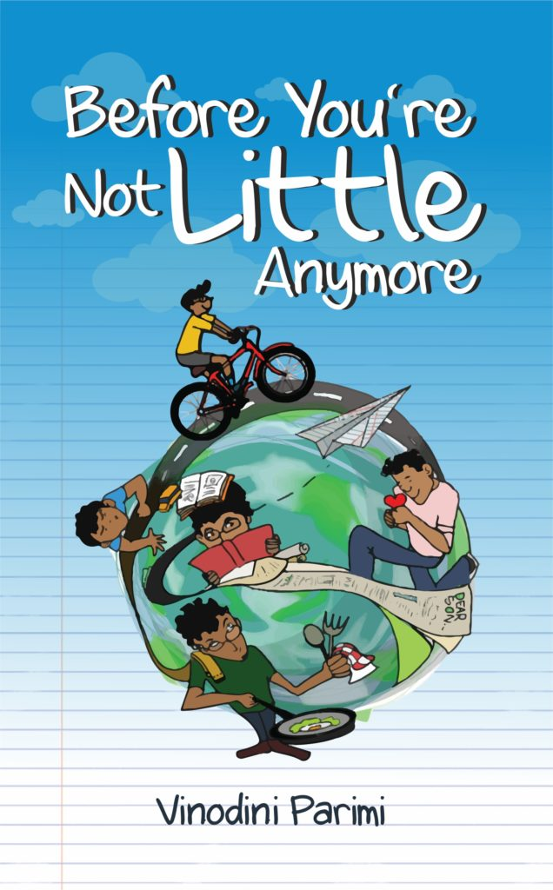

In the summer of 2017, my son was preparing for his 12th-grade board exams. He was simultaneously applying for admissions to universities abroad. It was pretty much clear that he was going to leave the nest for further studies. I had butterflies in my stomach wondering how he would cope with his new life and surroundings, left to himself. After all, he was an only child brought up in a sheltered and protected environment with minimum exposure to independent living.  
  
Around the same time, the April 2017 Blogging from A to Z Challenge was about to commence. I had participated in the challenge in the past but I wasn't sure if I was ready to do so this time around with so many overwhelming emotions running through me because of my son. I wondered if my mind could churn up anything else to write at that point.  
  
After mulling about it for days together I came up with the idea of writing letters to my son on my blog, to help him cope with various emotions and situations that most of us go through as a part of growing up. These letters are an attempt to cover the A to Z of important life skills that I hoped my son to be equipped with, based on my own experiences in life. Right from anger management to infatuation, from setting goals to developing patience, I wrote on every topic I felt I needed to guide him on. At the end of April on his 18th birthday, I gifted him these letters in the form of a book exclusively printed for him with a bunch of pictures clicked during different stages of his childhood. I hoped he would carry the book with him and refer to as a guide in times of confusion or advice.  
  
Those letters became the foundation of my first solo book 'Before You're Not Little Anymore.' Many readers and friends who read the letters, thought that it was content worth sharing with growing children and their parents. It took me a good two years to actually work on the raw manuscript adding a lot more thoughts, anecdotes and experiences from my life to transform it into a book worth publishing for the rest of the world.  
  
I owe the entire credit for this book to my son, who is the soul of this book. He brainstormed every tiny aspect of the book with me at all stages, making this teamwork worth cherishing. It's heartening to know that he still goes back to refer to the first draft of the book that I gifted him in times of need.  
  
My parents, my brother and my entire family had a big role to play in encouraging me to publish this book. I wonder what I'd have done without them!

My good friend, Elly Stornebrink, who I first met through the blogging world, edited the book. Her expertise helped me shape the book to add further value to it. I cannot thank her enough for it.  
  
The cherry on the cake is the book cover design which features beautiful illustrations rendered by one of the most creative teenagers I know. Aruvi Dave, an 18-year-old student of Architecture who is the daughter of my close friend Zaida Jacob, brought my book to life with her talented strokes. I felt that a teen designing a book cover for a book that was meant for teenagers was really apt. It was indeed my pleasure to have her design for me.  
  
A lot of my friends especially from the blogging and art/design community saw me through the rigorous process of getting the book published. I'm truly humbled by their help. I must make a special mention of my publisher, StoryMirror Infotech Private Limited. The entire team of StoryMirror has been extremely supportive and patient with me throughout these past few months.

  
Finally, the book is ready for release. I will share the details of the launch shortly. Before You're Not Little Anymore is available for pre-launch booking on the link [here](https://shop.storymirror.com/before-you-are-not-little-anymore/p/16se70v6jyecn9j4). It will be available for sale in India to start with, on Amazon, the [StoryMirror website](https://shop.storymirror.com/before-you-are-not-little-anymore/p/16se70v6jyecn9j4) and at major bookstores in select cities after the launch. The Kindle edition will be available in the following days.  
  
If you're wondering if you should buy this book, let me tell you why. Most children nowadays are moving out of the country for higher education. They require some amount of handholding in the first few days of their being independent. Although they appear to have grown up, they are still untouched and innocent kids at heart. Don't let their looks fool you!

And for those parents whose kids choose to continue living with them during their higher studies, despite the proximity, many parents find it difficult to broach certain topics with their children.  
  
In such a scenario sometimes it is difficult to verbalize everything. A reference book of sorts in trying times comes to their rescue.  
  
And last but not the least, if you're neither a parent nor a child, this book elaborates on life skills and practical tips that are helpful for every individual irrespective of their age or gender. So either way, it's probably worth a read! I look forward to your reviews and thoughts on the book. I thank each of you for all your support and best wishes.
