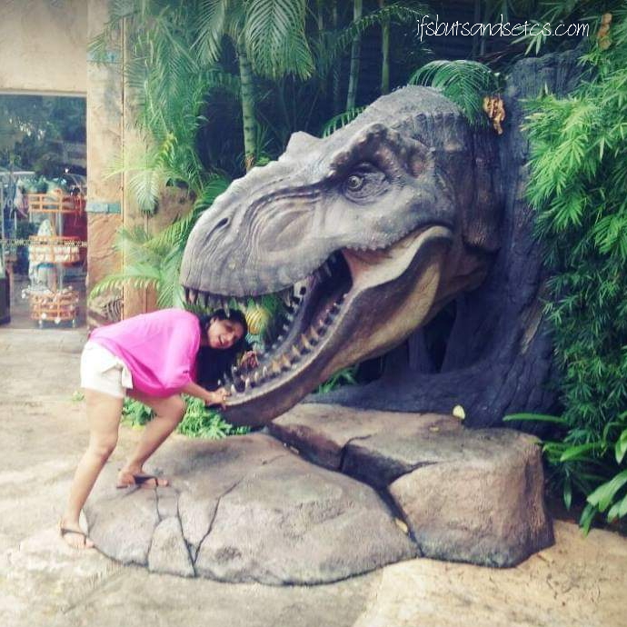

This year brought about a transformation in me. After a series of hits and misses last year, 2020 brought with it a placid calm. A kind of realization seeped through that only comes after you have traveled staggering miles and endured quite a bit of weathering to accept that this too had to be a part of your journey. And the journey goes on. The destination keeps changing, but time and again one needs to pause, reflect and look back before heading up the path ahead.

Sometimes you put in so much effort to get the desired results in your life that at the end of it, you realize that what you're left with was simply not worth the struggle. Unless you're passionate about what you're doing, then it's a different story. But when you're doing something for mere survival, at times the quality of survival gets diluted to the extent that you start questioning the need to put up with such an ordeal.

The specific experiences I am referring to, are far too many to fit into one post and are actually good enough to make a fat book, which I've started to write. But I could share my takeaways from these instances that I feel would probably help some of us who go through such questioning times. So, here are a few of them:

_\-When things don't go your way, it's not always because you didn't do well. Untoward things can happen despite our best-laid plans. Let go and start again, this time with a different approach._

_\-Listen and understand what everyone has to say to you, but do what your instincts tell you to. Oftentimes we know the answers subconsciously, but we refuse to accept them on a conscious level. Our instincts are the ones guiding us through this complex maze of beliefs and disbeliefs._

_\-Nothing lasts forever, although it might seem neverending. Everything on this earth comes with an expiry date, that includes situations and challenges._

_\-Comparing yourself with others is a killer! Although it is a natural human tendency to constantly evaluate and compare with others, it helps to remind ourselves that every finger on our hand is different yet useful in its own way. Love yourself for the way you are - flaws and imperfections included._

_\-And lastly, **know how much is too much**. Each of us is equipped with a different degree of tolerance. Just because the one next to you is still pulling through it, that doesn't mean you need to do the same. Learn to recognize when you've crossed your scales of endurance and the exact point where you need to stop. In that moment of epiphany, do yourself a favor and hit the brakes. Jump off the vehicle if you may and bid the bumpy ride a happy goodbye! Some roads are best left not traveled._

You might regret taking the sudden detour for some time, but after things settle down a bit, you'll understand how important it was to take that leap of faith, to look forward to the next adventure in your life! So, sit back and absorb the nothingness of today, coz' tomorrow is going to be another day that unfolds a fresh new chapter in your life.

