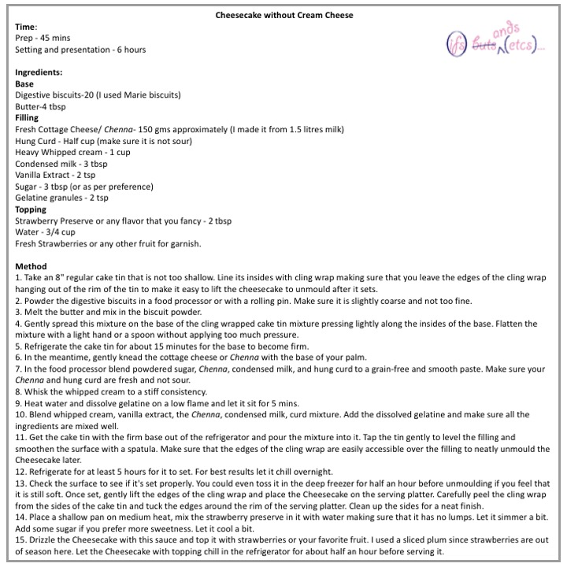
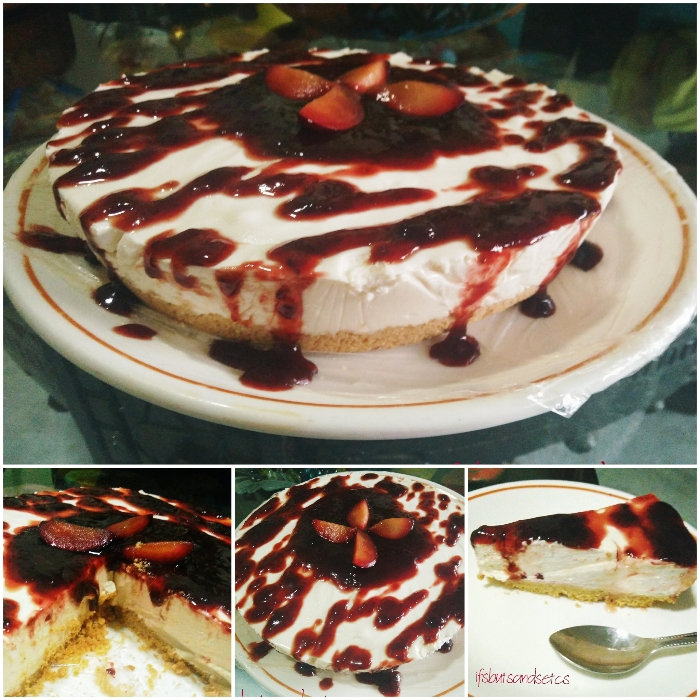
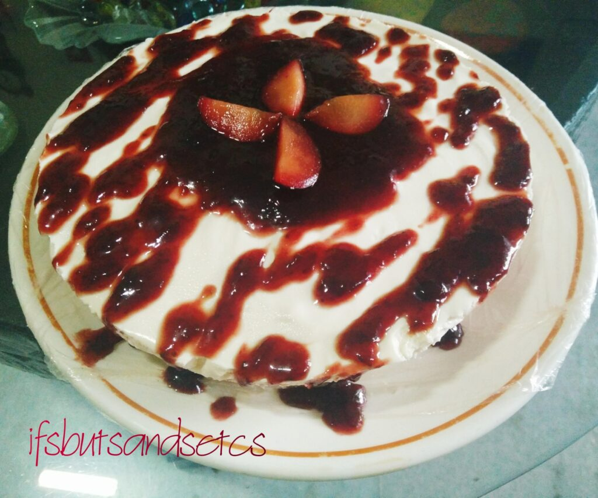

What is it that deters you from making your sinful Cheesecake at home? Despite the fact that it actually is one of the easiest desserts to rustle up and a hot favorite of almost all of you with a sweet tooth out there. Well, here in India, it is mostly because of the non-availability of one vital ingredient that goes into it—cream cheese. And even if it's available in some specialty stores it turns out to be a little pricey.

I had been using Philadelphia cream cheese bought off the counter for all my Cheesecake preparations so far. Until recently when I set off on a mission to come up with a cheesecake without using the commercially available cream cheese.

Another not-so-important but a differentiator nevertheless for ending up with a decent Cheesecake presentation is using a springform pan for making one. A beautifully unmoulded cheesecake is a sight to behold! Unfortunately, I somehow haven't managed to get a springform pan as yet. I'd end up setting my Cheesecake in either glass casseroles or dessert glasses. So this time I also wanted a good alternative for unmoulding the Cheesecake perfectly without a springform pan.

I scouted for some recipes online and looked for quick-fixes for my dilemma. Finally, I came up with a solution based on my findings. This recipe is personalized to my taste...and boy...was it mission accomplished? Absolutely, 100%!

So here's the recipe. Feel free to tweak it as per your taste and desired consistency.

**Time**:  
Prep - 45 mins  
Setting and presentation - 6 hours

**Ingredients:**  
**Base**  
Digestive biscuits-20 (I used Marie biscuits)  
Butter-4 tbsp  
**Filling**  
Fresh Cottage Cheese/ _Chenna_\- 150 gms approximately (I made it from 1.5 liters milk)  
Hung Curd - Half cup (make sure it is not sour)  
Heavy Whipped cream - 1 cup  
Condensed milk - 3 tbsp  
Vanilla Extract - 2 tsp  
Sugar - 3 tbsp (or as per preference)  
Gelatine granules- 2 tsp  
**Topping**  
Strawberry Preserve or any flavor that you fancy - 2 tbsp  
Water - 3/4 cup  
Fresh Strawberries or any other fruit for garnish.

**Method**  
1\. Take an 8" regular cake tin that is not too shallow. Line its insides with cling wrap making sure that you leave the edges of the cling wrap hanging out of the rim of the tin to make it easy to lift the cheesecake to unmould after it sets.  
2\. Powder the digestive biscuits in a food processor or with a rolling pin. Make sure it is slightly coarse and not too fine.  
3\. Melt the butter and mix in the biscuit powder.  
4\. Gently spread this mixture on the base of the cling wrapped cake tin mixture pressing lightly along the insides of the base. Flatten the mixture with a light hand or a spoon without applying too much pressure.  
5\. Refrigerate the cake tin for about 15 minutes for the base to become firm.  
6\. In the meantime, gently knead the cottage cheese or _Chenna_ with the base of your palm.  
7\. In the food processor blend powdered sugar, _Chenna_, condensed milk, and hung curd to a grain-free and smooth paste. Make sure your _Chenna_ and hung curd are fresh and not sour.  
8\. Whisk the whipped cream to a stiff consistency.  
9\. Heat water and dissolve gelatine on a low flame and let it sit for 5 mins.  
10\. Blend whipped cream, vanilla extract, the _Chenna_, condensed milk, curd mixture. Add the dissolved gelatine and make sure all the ingredients are mixed well.  
11\. Get the cake tin with the firm base out of the refrigerator and pour the mixture into it. Tap the tin gently to level the filling and smoothen the surface with a spatula. Make sure that the edges of the cling wrap are easily accessible over the filling to neatly unmould the Cheesecake later.  
12\. Refrigerate for at least 5 hours for it to set. For best results let it chill overnight.  
13\. Check the surface to see if it's set properly. You could even toss it in the deep freezer for half an hour before unmoulding if you feel that it is still soft. Once set, gently lift the edges of the cling wrap and place the Cheesecake on the serving platter. Carefully peel the cling wrap from the sides of the cake tin and tuck the edges around the rim of the serving platter. Clean up the sides for a neat finish.  
14\. Place a shallow pan on medium heat, mix the strawberry preserve in it with water making sure that it has no lumps. Let it simmer a bit. Add some sugar if you prefer more sweetness. Let it cool a bit.  
15\. Drizzle the Cheesecake with this sauce and top it with strawberries or your favorite fruit. I used a sliced plum since strawberries are out of season here. Let the Cheesecake with topping chill in the refrigerator for about half an hour before serving it.

This Cheesecake turned out better than the ones where I had used cream cheese, both in terms of the texture and the flavor. It was quite decadent, to say the least! It stays good for about 3 days after which it might taste a bit sour due to the addition of hung curds. But well, at our place, a Cheesecake gets polished off in no time anyway!

So well, although the entire recipe is phased out for setting it well as in the case of any Cheesecake prep, it really is quite simple to make. If you happen to try it, do let me know how it turns out. in the comments section below. Also, if you're interested, check out my [Baked Mango Cheesecake](https://ifsbutsandsetcs.com/2019/06/baked-mango-cheesecake/) recipe that I posted last summer.

Till then go make your own Cheesecake, dig in watching your fav Netflix show...and chill!

