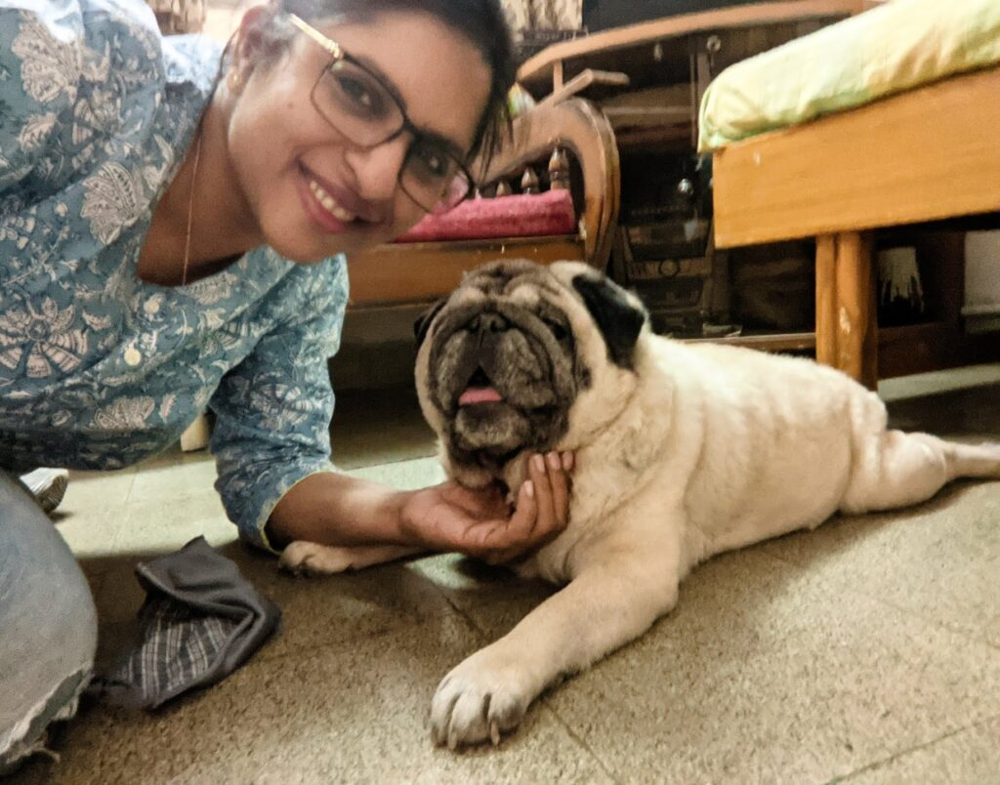
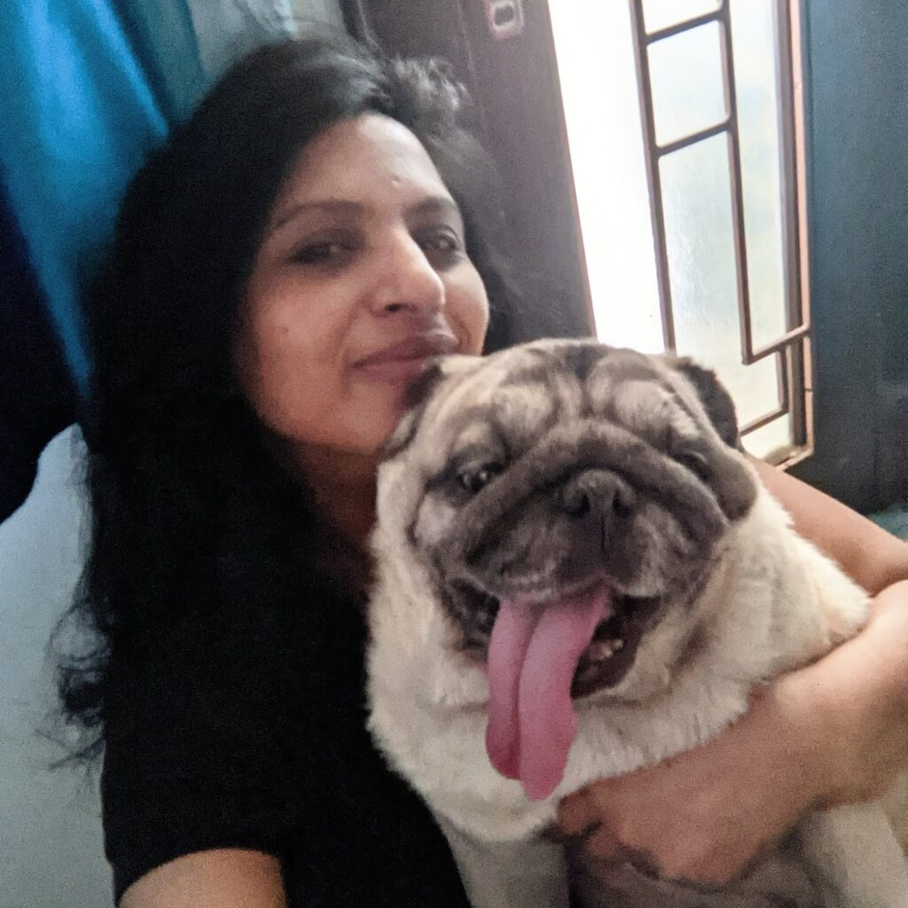

It is exactly a month today since we got Sam home. His second and hopefully his forever home. He is a delightfully adorable eight-year-old Pug. I have had the pleasure of having a four-legged companion after a long period of six years after having lost our beloved Roger, an absolutely lovable six-year-old golden labrador with deep liquid-brown eyes.  
  
I had been pining for a pet for quite some time now and with the onset of the pandemic my desperation to get one multiplied manifold. Ever since I got Sam I have had a lot of people asking me why I chose to adopt such a senior dog. Actually, when I first started looking for a fur buddy for adoption I too had this mindset of wanting to adopt a young puppy hoping to enjoy seeing it grow and spending its entire life span with me.  
  
It so happened that Sam's previous family had to permanently move to Canada due to unavoidable reasons. And as much as they wanted to take their darling pet with them, certain rules prohibit dogs of his breed to travel by air. Brachycephalic snub-nosed dog breeds such as Pugs, Boxers, and Pekingese are prone to breathing difficulties making it risky for them to travel by air. So despite their best intentions, Sam's family was on tenterhooks about being unable to take him with them. Sadly, the only choice they had was to put him up for adoption.  
  
When I first saw their post on a Facebook page, I fell completely in love with this pudgy bundle of awesomeness. And when I got to know the reason why he was up for adoption my heart went out for him! I so badly wanted to hold him tight, comfort him in whatever way I could, and make up for his family's absence when they would be gone. It didn't matter how old he was. Shockingly, I read some heartless comments on the Facebook post by people who judged the poor family for their decision to put him up for adoption. People often make assumptions without knowing the facts. I mean, c'mon, who would willingly want to give up their loving eight-year-old companion without a solid reason?  
  
I soon got in touch with his family, a middle-aged couple. One thing led to another and within a few hours, they came to meet us and inspect our house. That particular day they actually visited close to six houses of people who expressed an interest in adopting Sam. Such was their concern for their dear pet that they carefully scrutinized every best possible option for him. After filtering through scores of calls, messages, and house visits that came to them from faraway cities also, they decided that our house was the best for their child.  
  
The family was to fly out in the coming week. We decided that it would be best if we first interacted with Sam in both their house as well as ours to familiarize him with us and his new house. So the next day I set out to meet him for the first time at his place. I decided to let him come to me instead of gushing at the first sight of him, just to let him get comfortable around me. When the lady of the house ushered me into their apartment I was immediately captured by this fawn-colored chubby guy with half a tongue sticking out of his mouth staring at me cheekily with his large black bulbous beady eyes burrowed amidst deep folds of a frown. He sniffed a bit and immediately took to playing with my fingers. A few playful minutes later Sam's mother felt confident that I was capable of giving him the love that he got from her all these years. She hadn't seen him ever taking to someone new as instantly as in my case.

<figure>

<figcaption>

**Our First Meeting**

</figcaption>

</figure>

The next day Sam visited our house with his parents. He sensed that we were up to something. He sniffed the house nervously with heavy anxious breathing as we led him around to familiarize him with his would-be house. This pattern continued for another week. Either I would visit him or his parents would get him to our place. Finally, the day came when it was time for him to bid farewell to his family. We decided to get him during the day so that he would have settled a bit in the new environment by the end of the day.  
  
The day we picked him up, my parents and I got our first jab of the Covid vaccine, so both the milestones coincided! We picked him up from his house with two large bags full of his belongings, toys, treats, towels, records, meds, toiletries, clothes, his bed and so many other knick-knacks collected over a period of his eight years with them. His mother hugged him tight with tears overflowing asking me to take good care of her darling baby. It was an emotional moment. I could imagine how it must have felt for both of them. Animals can't speak but they are highly sensitive to emotions and the change of energy around them.  
  
When he walked into our house that day he was already familiar with the surroundings. He knew where his room was and he quietly headed towards my room. Time and again his breathing would get raspy and heavy indicating his anxiety, but with lots of cuddles and soothing words he gradually settled down. At night I put on some gentle dog-friendly music for him to relax and sleep. He slept like a baby. There was something similar between his situation and mine. His parents and my son, both had to move to Canada for their own reasons. And here we were, together, trying to offer solace to each other.  
  
In the next few days, he figured out his way around the house and our routines. We were amazed by the way he adjusted to his new surrounding so easily. It took him a few weeks to wander out and relax in the other rooms. Initially, he would prefer being confined only to my room, venturing out only at mealtimes or for his walks. But nowadays he seems to be comfortable lounging around in the other rooms as well.  
  
His previous family makes a video call every few days and has some screen time with him. They are at ease in the knowledge that he is with people who care for him. Looking back at the unfolding of events, I now wonder why is it that we hesitate to adopt older pets. I know it's easier to bond with younger animals and they are much more active and naughtier than the older ones. But adopting a senior dog has a charm of its own. For once, most of them are toilet-trained and done with their teething issues! So there are no messy homes or unpleasant surprises on that front. They are just as affectionate as young puppies, and once you win their trust, the bond is much more stronger and mature than ever. While some might argue, that the older pets have a limited time with you as they are well into their golden period, I'd say that makes them even more deserving to be with a loving family who can take care of them in their prime years. After all, it's a two-way thing. For all that unconditional love that they offer, they absolutely deserve it back in return. Most humans are incapable of the strong loyalty that these endearing beings display.  
  
My days have transformed with having Sam around. As we are headed on a journey to know each other better, the warm cuddles, his pink tongue peeping out of his toothless smile, and eager black goblet eyes make my days! Sometimes when I catch him staring into dark nothingness in the middle of the night seemingly lost in some deep thoughts like a retired old man, I scoop him up in a big tight hug and get rewarded with wet sloppy licks. I wonder what goes on in his tiny mind. While he's relatively mellow and less active due to his age, he is every bit a sweetheart, amusing us with his antics and cuteness all the time. He is like this sweet little podgy boy who has to be cajoled out of his laziness for even the tiniest bit of effort! After having spent nearly half his life with a purely vegetarian family, he's now discovering the joys of chewing on a juicy mean bone and enjoying his meaty meals at his new home. Well, someone's got lucky! And I really can't decide who is luckier. He or I?

<figure>

<figcaption>

**Finally Home!**

</figcaption>

</figure>
